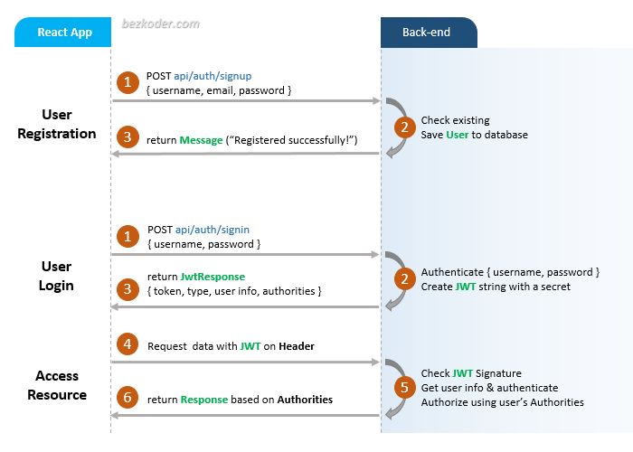
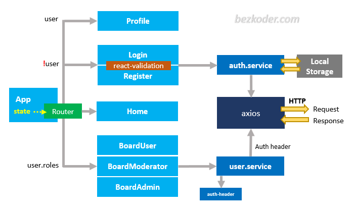

# React + TypeScript + Vite

This template provides a minimal setup to get React working in Vite with HMR and some ESLint rules.

Currently, two official plugins are available:

- [@vitejs/plugin-react](https://github.com/vitejs/vite-plugin-react/blob/main/packages/plugin-react/README.md) uses [Babel](https://babeljs.io/) for Fast Refresh
- [@vitejs/plugin-react-swc](https://github.com/vitejs/vite-plugin-react-swc) uses [SWC](https://swc.rs/) for Fast Refresh

## Expanding the ESLint configuration

If you are developing a production application, we recommend updating the configuration to enable type aware lint rules:

- Configure the top-level `parserOptions` property like this:

```js
export default {
  // other rules...
  parserOptions: {
    ecmaVersion: 'latest',
    sourceType: 'module',
    project: ['./tsconfig.json', './tsconfig.node.json'],
    tsconfigRootDir: __dirname,
  },
}
```

- Replace `plugin:@typescript-eslint/recommended` to `plugin:@typescript-eslint/recommended-type-checked` or `plugin:@typescript-eslint/strict-type-checked`
- Optionally add `plugin:@typescript-eslint/stylistic-type-checked`
- Install [eslint-plugin-react](https://github.com/jsx-eslint/eslint-plugin-react) and add `plugin:react/recommended` & `plugin:react/jsx-runtime` to the `extends` list

## React JWT Authentication (without Redux) example

In this tutorial, we’re gonna build a React JWT Authentication example with LocalStorage, React Router, Axios and Bootstrap (without Redux). I will show you:

- JWT Authentication Flow for User Signup & User Login
- Project Structure for React JWT Authentication (without Redux) with LocalStorage, React Router & Axios
- Creating React Components with Form Validation
- React Components for accessing protected Resources (Authorization)
- Dynamic Navigation Bar in React App

## User Registration and User Login Flow
For JWT Authentication, we’re gonna call 2 endpoints:

- POST `api/auth/signup` for User Registration
- POST `api/auth/signin` for User Login

The following flow shows you an overview of Requests and Responses that React Client will make or receive. This React Client must add a JWT to HTTP Header before sending request to protected resources.



## Demo Video
This is full React + Node.js Express JWT Authentication & Authorization demo (with form validation, check signup username/email duplicates, test authorization with 3 roles: Admin, Moderator, User):

[](http://www.youtube.com/watch?v=tNcWX9qPcCM "React + Node.js Express JWT Authentication & Authorization demo")

Or React with Spring Boot Server:

[](http://www.youtube.com/watch?v=CsgtYvlR7xk "Spring Boot Reactjs JWT Authentication example")

## React Component Diagram with Router, Axios & LocalStorage



For more detail, please visit:
> [React (without Redux) JWT Authentication & Authorization example](https://www.bezkoder.com/react-jwt-auth/)

> [React JWT Authentication & Authorization example with HttpOnly Cookie](https://www.bezkoder.com/react-login-example-jwt-hooks/)

> [React - How to Logout when Token is expired](https://www.bezkoder.com/react-logout-token-expired/)

> [React Redux JWT Authentication & Authorization example](https://www.bezkoder.com/react-redux-jwt-auth/)

> [React Hooks: JWT Authentication & Authorization example](https://www.bezkoder.com/react-hooks-jwt-auth/)

> [React + Redux + Hooks: JWT Authentication & Authorization example](https://www.bezkoder.com/react-hooks-redux-login-registration-example/)

This project was bootstrapped with [Create React App](https://github.com/facebook/create-react-app).

### Set port
.env
```
PORT=3000
```

## Note:
Open `src/services/auth-header.js` and modify `return` statement for appropriate back-end (found in the tutorial).

```js
export default function authHeader() {
  const user = JSON.parse(localStorage.getItem('user'));

  if (user && user.accessToken) {
    // return { Authorization: 'Bearer ' + user.accessToken }; // for Spring Boot back-end
    return { 'x-access-token': user.accessToken };             // for Node.js Express back-end
  } else {
    return {};
  }
}
```

## Project setup

In the project directory, you can run:

```
npm install
# or
yarn install
```

or

### Compiles and hot-reloads for development

```
npm start
# or
yarn start
```

Open [http://localhost:8081](http://localhost:8081) to view it in the browser.

The page will reload if you make edits.

## Related Posts
> [In-depth Introduction to JWT-JSON Web Token](https://www.bezkoder.com/jwt-json-web-token/)

> [React.js CRUD example to consume Web API](https://www.bezkoder.com/react-crud-web-api/)

> [React Pagination example](https://www.bezkoder.com/react-pagination-material-ui/)

> [React File Upload with Axios and Progress Bar to Rest API](https://www.bezkoder.com/react-file-upload-axios/)

Fullstack (JWT Authentication & Authorization example):
> [React + Spring Boot](https://www.bezkoder.com/spring-boot-react-jwt-auth/)

> [React + Node.js Express](https://www.bezkoder.com/react-express-authentication-jwt/)

CRUD with Node.js Express:
> [React.js + Node.js Express + MySQL](https://www.bezkoder.com/react-node-express-mysql/)

> [React.js + Node.js Express + PostgreSQL](https://www.bezkoder.com/react-node-express-postgresql/)

> [React.js + Node.js Express + MongoDB](https://www.bezkoder.com/react-node-express-mongodb-mern-stack/)

CRUD with Spring Boot:
> [React.js + Spring Boot + MySQL](https://www.bezkoder.com/react-spring-boot-crud/)

> [React.js + Spring Boot + PostgreSQL](https://www.bezkoder.com/spring-boot-react-postgresql/)

> [React.js + Spring Boot + MongoDB](https://www.bezkoder.com/react-spring-boot-mongodb/)

CRUD with Django:
> [React.js + Django Rest Framework](https://www.bezkoder.com/django-react-axios-rest-framework/)

Serverless:
> [React Firebase CRUD App with Realtime Database](https://www.bezkoder.com/react-firebase-crud/)

> [React Firestore CRUD App example | Firebase Cloud Firestore](https://www.bezkoder.com/react-firestore-crud/)

Integration (run back-end & front-end on same server/port)
> [Integrate React with Spring Boot](https://www.bezkoder.com/integrate-reactjs-spring-boot/)

> [Integrate React with Node.js Express](https://www.bezkoder.com/integrate-react-express-same-server-port/)


###-------------------------------------
# Getting Started with Create React App

This project was bootstrapped with [Create React App](https://github.com/facebook/create-react-app).

## Available Scripts

In the project directory, you can run:

### `yarn start`

Runs the app in the development mode.\
Open [http://localhost:3000](http://localhost:3000) to view it in your browser.

The page will reload when you make changes.\
You may also see any lint errors in the console.

### `yarn test`

Launches the test runner in the interactive watch mode.\
See the section about [running tests](https://facebook.github.io/create-react-app/docs/running-tests) for more information.

### `yarn build`

Builds the app for production to the `build` folder.\
It correctly bundles React in production mode and optimizes the build for the best performance.

The build is minified and the filenames include the hashes.\
Your app is ready to be deployed!

See the section about [deployment](https://facebook.github.io/create-react-app/docs/deployment) for more information.

### `yarn eject`

**Note: this is a one-way operation. Once you `eject`, you can't go back!**

If you aren't satisfied with the build tool and configuration choices, you can `eject` at any time. This command will remove the single build dependency from your project.

Instead, it will copy all the configuration files and the transitive dependencies (webpack, Babel, ESLint, etc) right into your project so you have full control over them. All of the commands except `eject` will still work, but they will point to the copied scripts so you can tweak them. At this point you're on your own.

You don't have to ever use `eject`. The curated feature set is suitable for small and middle deployments, and you shouldn't feel obligated to use this feature. However we understand that this tool wouldn't be useful if you couldn't customize it when you are ready for it.

## Learn More

You can learn more in the [Create React App documentation](https://facebook.github.io/create-react-app/docs/getting-started).

To learn React, check out the [React documentation](https://reactjs.org/).

### Code Splitting

This section has moved here: [https://facebook.github.io/create-react-app/docs/code-splitting](https://facebook.github.io/create-react-app/docs/code-splitting)

### Analyzing the Bundle Size

This section has moved here: [https://facebook.github.io/create-react-app/docs/analyzing-the-bundle-size](https://facebook.github.io/create-react-app/docs/analyzing-the-bundle-size)

### Making a Progressive Web App

This section has moved here: [https://facebook.github.io/create-react-app/docs/making-a-progressive-web-app](https://facebook.github.io/create-react-app/docs/making-a-progressive-web-app)

### Advanced Configuration

This section has moved here: [https://facebook.github.io/create-react-app/docs/advanced-configuration](https://facebook.github.io/create-react-app/docs/advanced-configuration)

### Deployment

This section has moved here: [https://facebook.github.io/create-react-app/docs/deployment](https://facebook.github.io/create-react-app/docs/deployment)

### `yarn build` fails to minify

This section has moved here: [https://facebook.github.io/create-react-app/docs/troubleshooting#npm-run-build-fails-to-minify](https://facebook.github.io/create-react-app/docs/troubleshooting#npm-run-build-fails-to-minify)
